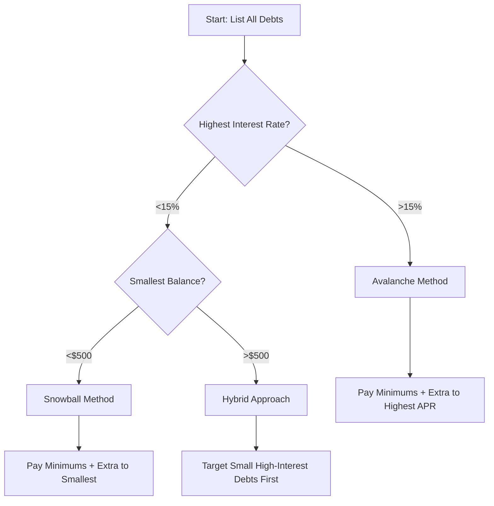

# Task: Plan Chapter Visuals

**Agent**: Visual Designer (Vera)
**Output**: Visual plan with image suggestions and prompts
**Elicit**: true

## Purpose
Analyze chapter content and create a comprehensive visual plan identifying optimal placement for images, diagrams, charts, and other visual elements.

## Prerequisites
- Chapter draft exists in `chapters/chapter-{NN}.md`
- Book Blueprint Document available (for visual style preferences)
- Learning Framework available (for learning objectives)

## Process

### Step 1: Read Chapter Content

Load and analyze the chapter:
```bash
cat chapters/chapter-{NN}.md
```

Identify:
- Main sections and topics
- Key concepts that benefit from visualization
- Complex processes or workflows
- Data/statistics that need charts
- Examples that benefit from photos
- Abstract concepts needing illustration

### Step 2: Identify Visual Opportunities

Scan chapter for visualization opportunities:

**Look for:**

1. **Processes/Workflows** → Diagrams/Flowcharts
   - Keywords: "first..., then..., next..., finally..."
   - "Steps:", "Process:", "How to..."
   - Sequential explanations

2. **Data/Statistics** → Charts/Graphs
   - Numerical comparisons
   - Trends over time
   - Percentage breakdowns
   - "X% of...", "compared to...", "increased by..."

3. **Concepts/Relationships** → Diagrams/Illustrations
   - "Consists of...", "components include..."
   - Hierarchies, categories, taxonomies
   - Cause-and-effect relationships

4. **Real-World Examples** → Photos
   - Case studies
   - "Imagine...", "Picture this..."
   - Lifestyle scenarios

5. **Abstract Ideas** → Conceptual Illustrations
   - Metaphors: "like a...", "similar to..."
   - Analogies
   - Theoretical frameworks

6. **Tools/Software** → Screenshots
   - "In the app...", "Click on..."
   - Tutorial steps
   - Interface demonstrations

### Step 3: Categorize Visual Needs

For each identified opportunity, determine:

**Visual Type**:
- Photo/Stock Image
- Diagram (flowchart, process diagram, mind map)
- Chart/Graph (bar, line, pie, comparison table)
- Illustration (conceptual, metaphorical)
- Screenshot (software UI, app interface)
- Icon/Symbol (quick reference markers)

**Priority**:
- 🔴 **Critical**: Essential for comprehension
- 🟡 **Important**: Significantly enhances understanding
- 🟢 **Nice-to-have**: Adds engagement but not required

**Source Strategy**:
- Author-provided (requires author to supply image)
- AI-generated (create detailed prompt)
- Stock library (provide search keywords)
- Create programmatically (chart/diagram code)

### Step 4: Elicit Author's Visual Resources

**CRITICAL - Elicit from user:**

```
I've analyzed Chapter {N} and identified {count} opportunities for visual enhancement.

Before I create the detailed visual plan, let me understand your available resources:

1. **Do you have existing images for this topic?**
   - Personal photos
   - Diagrams you've created
   - Screenshots
   - Charts from presentations

   If yes, please place them in: `resources/images/author-provided/chapter-{NN}/`

2. **For images you don't have, what's your preference?**
   a) I create detailed AI image generation prompts (you generate images)
   b) I suggest stock image keywords (you source images)
   c) I generate images automatically (requires setup of image generation tools)
   d) Mix of the above

3. **Visual style preference for this book:**
   - Professional/corporate
   - Friendly/approachable
   - Minimalist/clean
   - Colorful/vibrant
   - Academic/serious

4. **Technical capability:**
   - Can you generate images from prompts (DALL-E, Midjourney, etc.)?
   - Do you have stock image subscriptions (Shutterstock, Adobe Stock)?
   - Should I use free stock sources only (Unsplash, Pexels)?

Please respond with your preferences, and I'll create a tailored visual plan.
```

Wait for user response before proceeding.

### Step 5: Create Visual Plan Document

**File**: `resources/visuals/chapter-{NN}-visual-plan.md`

```markdown
# Visual Plan: Chapter {N} - {Chapter Title}

**Date**: {Current Date}
**Visual Designer**: Vera (BMAD Visual Designer)
**Chapter File**: chapters/chapter-{NN}.md

---

## Executive Summary

- **Total Visual Elements Planned**: {count}
- **Critical (🔴)**: {count}
- **Important (🟡)**: {count}
- **Nice-to-have (🟢)**: {count}

**Visual Types Breakdown**:
- Photos: {count}
- Diagrams: {count}
- Charts/Graphs: {count}
- Illustrations: {count}
- Screenshots: {count}

**Source Strategy**:
- Author-provided: {count}
- AI-generated: {count}
- Stock library: {count}
- Programmatically created: {count}

---

## Visual Elements by Section

### Section 1: {Section Name}

#### Visual 1.1: {Descriptive Name}
**Priority**: 🔴 Critical
**Type**: Flowchart/Process Diagram
**Location**: After paragraph introducing the 5-step process
**File Name**: `fig-01-debt-repayment-flowchart.png`

**Purpose**: Visualize the decision tree for choosing debt repayment strategy

**Content Requirements**:
- Show 5-step decision process
- Include decision points (yes/no branches)
- Highlight recommended path
- Use consistent color coding (green=recommended, red=caution)

**Source Strategy**: Create programmatically with Mermaid

**Mermaid Code**:


**Markdown Embed**:
```markdown


*Figure {N}.1: Decision flowchart for choosing optimal debt repayment strategy*
```

---

#### Visual 1.2: {Descriptive Name}
**Priority**: 🟡 Important
**Type**: Photo/Stock Image
**Location**: Opening of section "Real-World Success Story"
**File Name**: `fig-02-person-celebrating-debt-free.jpg`

**Purpose**: Emotional connection - show joy of becoming debt-free

**Visual Description**:
- Person (30-40 years old, relatable to target audience)
- Celebrating at home office/kitchen table
- Laptop showing "Paid in Full" or checking account at $0 debt
- Genuine smile, relief, accomplishment emotion
- Natural lighting, authentic (not overly staged)

**Source Strategy**: {Based on user preference from Step 4}

{If AI-generated:}
**AI Image Prompt** (DALL-E/Midjourney/Stable Diffusion):
```
Professional photograph of a happy middle-aged person sitting at home office desk,
laptop screen showing financial dashboard with "Debt: $0" prominently displayed,
genuine smile of relief and accomplishment, arms raised in celebration gesture,
warm natural window lighting, cozy home office background with plants,
photorealistic style, candid moment, high detail, 8k resolution,
diversity in representation, authentic emotion not stock-photo-smile
```

{If stock library:}
**Stock Image Keywords**: "person celebrating debt free", "financial freedom joy", "home office celebration", "debt paid off happy"

**Markdown Embed**:
```markdown


*Figure {N}.2: The emotional reward of achieving debt freedom*
```

**Alt Text**: "A happy person at their home office desk celebrating with raised arms as their laptop shows they've paid off all debt"

---

#### Visual 1.3: {Descriptive Name}
**Priority**: 🔴 Critical
**Type**: Bar Chart
**Location**: In section "Comparing Repayment Methods"
**File Name**: `fig-03-repayment-comparison-chart.png`

**Purpose**: Show time and interest savings of different repayment strategies

**Data to Visualize**:
| Strategy | Time to Debt-Free | Total Interest Paid |
|----------|-------------------|---------------------|
| Minimum Payments Only | 15 years | $12,500 |
| Snowball Method | 8 years | $8,200 |
| Avalanche Method | 6 years | $6,800 |
| Hybrid Approach | 7 years | $7,300 |

**Chart Specifications**:
- Grouped bar chart
- X-axis: Repayment strategy
- Y-axis 1 (left): Years to debt-free (blue bars)
- Y-axis 2 (right): Total interest paid in $ (red bars)
- Clear legend
- Data labels on bars
- Professional color scheme (blue/red or brand colors)

**Source Strategy**: {Based on user technical capability}

{If programmatic generation:}
**QuickChart API URL**:
```
https://quickchart.io/chart?c={
  type: 'bar',
  data: {
    labels: ['Minimum Only', 'Snowball', 'Avalanche', 'Hybrid'],
    datasets: [{
      label: 'Years to Debt-Free',
      data: [15, 8, 6, 7],
      backgroundColor: '#4A90E2',
      yAxisID: 'y1'
    }, {
      label: 'Total Interest ($)',
      data: [12500, 8200, 6800, 7300],
      backgroundColor: '#E24A4A',
      yAxisID: 'y2'
    }]
  },
  options: {
    scales: {
      y1: {type: 'linear', position: 'left', title: {display: true, text: 'Years'}},
      y2: {type: 'linear', position: 'right', title: {display: true, text: 'Interest Paid ($)'}}
    }
  }
}
```

{If AI-generated:}
**AI Image Prompt**:
```
Professional business bar chart comparing debt repayment strategies,
grouped bars showing "Years to Debt-Free" (blue) and "Total Interest Paid" (red),
four categories: Minimum Payments, Snowball Method, Avalanche Method, Hybrid,
clean modern design, white background, clear data labels,
infographic style, high contrast, readable fonts, 8k resolution
```

**Markdown Embed**:
```markdown


*Figure {N}.3: Comparison of repayment strategies by time to debt-free and total interest paid. The Avalanche Method saves the most money, while Snowball Method provides psychological wins.*
```

---

[Continue for all visual elements in chapter...]

---

## Visual Assets Checklist

### Author Must Provide:
- [ ] {Description of image 1} → Save as: `author-provided/chapter-{NN}/{filename}`
- [ ] {Description of image 2}

### To Be AI-Generated (Prompts Ready):
- [ ] Visual 1.2: Person celebrating debt-free
- [ ] Visual 2.5: Compound interest illustration

### To Be Created Programmatically:
- [ ] Visual 1.1: Debt repayment flowchart (Mermaid)
- [ ] Visual 1.3: Repayment comparison chart (QuickChart)

### Stock Images to Source:
- [ ] Visual 3.2: Budget planning scene
  - Keywords: "family budget planning", "financial discussion"
  - Sources: Unsplash, Pexels

---

## Implementation Steps

1. **Gather Author Images** (if any)
   - Author places images in `resources/images/author-provided/chapter-{NN}/`
   - Run: `*organize-author-images` to process and optimize

2. **Generate AI Images** (if user selected this option)
   - Use provided prompts with DALL-E/Midjourney/Stable Diffusion
   - Save generated images to `resources/images/chapter-{NN}/`
   - Follow naming convention: `fig-{NN}-{descriptive-name}.{ext}`

3. **Create Programmatic Visuals**
   - Run Mermaid diagrams (I can generate these)
   - Generate charts via QuickChart API or code
   - Save to `resources/images/chapter-{NN}/`

4. **Source Stock Images**
   - Search using provided keywords
   - Download high-resolution versions
   - Save to `resources/images/chapter-{NN}/`
   - Document source in metadata file

5. **Embed Visuals in Chapter**
   - Run: `*embed-visuals {chapter_number}`
   - This will add all Markdown image embeds with captions and alt text

6. **Create Metadata File**
   - Run: `*create-metadata {chapter_number}`
   - Documents sources, usage rights, descriptions

---

## Accessibility Notes

All visuals include:
- ✅ Descriptive alt text (not just "image of X")
- ✅ Figure captions explaining relevance
- ✅ For charts/graphs: Key data points in caption
- ✅ Sufficient contrast for text in images
- ✅ Text alternatives for critical information

---

## Next Steps

1. [ ] Author reviews visual plan
2. [ ] Author provides images (if applicable)
3. [ ] Generate/source remaining images
4. [ ] Embed visuals in chapter
5. [ ] Create metadata file
6. [ ] Verify accessibility compliance
7. [ ] Proceed to lector review

```

### Step 6: Automatically Commit Visual Plan

**CRITICAL:** Automatically commit the visual plan to Git:

```bash
mkdir -p resources/visuals
git add resources/visuals/chapter-{NN}-visual-plan.md
git commit -m "Add visual plan for chapter {N}

🎨 {total_count} visual elements planned
📊 {diagram_count} diagrams, {chart_count} charts, {photo_count} photos
✅ Prompts and specifications ready for implementation

🤖 Generated with [Claude Code](https://claude.com/claude-code)

Co-Authored-By: Claude <noreply@anthropic.com>"
```

**IMPORTANT:**
- DO commit automatically after creating visual plan
- DO NOT push automatically (user decides when to push)

### Step 7: Present Plan to User

Inform user:

```
✅ Visual plan created for Chapter {N}!

📋 Plan: resources/visuals/chapter-{NN}-visual-plan.md

📊 Summary:
- {total} visual elements planned
- {critical} critical for comprehension 🔴
- {important} significantly enhance understanding 🟡
- {nice_to_have} add engagement 🟢

📂 Visual breakdown:
- {photos} photos/images
- {diagrams} diagrams/flowcharts
- {charts} charts/graphs
- {illustrations} illustrations
- {screenshots} screenshots

📝 Next steps:
1. Review the visual plan
2. {If author-provided images needed}: Place your images in resources/images/author-provided/chapter-{NN}/
3. {If AI generation}: I've created detailed prompts for you
4. {If programmatic}: I can generate diagrams/charts automatically
5. Run *embed-visuals {chapter_number} when images are ready

✅ Committed to Git (not pushed - you control when to push)
```

## Success Criteria

- [ ] Chapter thoroughly analyzed for visual opportunities
- [ ] Visual needs categorized by type and priority
- [ ] User preferences elicited (source strategy, style, capability)
- [ ] Comprehensive visual plan created with specifications
- [ ] AI image prompts detailed and ready to use
- [ ] Mermaid/code provided for programmatic visuals
- [ ] Stock image keywords provided where applicable
- [ ] Markdown embed code ready for all visuals
- [ ] Accessibility considerations (alt text, captions) included
- [ ] Implementation checklist provided
- [ ] Visual plan automatically committed to Git (not pushed)
- [ ] User informed of next steps

## Notes

- **Strategic placement**: Visuals should appear at point of maximum pedagogical impact
- **Quality over quantity**: Better to have fewer high-quality visuals than many mediocre ones
- **Consistent style**: All visuals should have coherent visual language
- **Accessibility first**: Alt text and captions are not optional
- **Source documentation**: Always track where images come from (licensing!)
